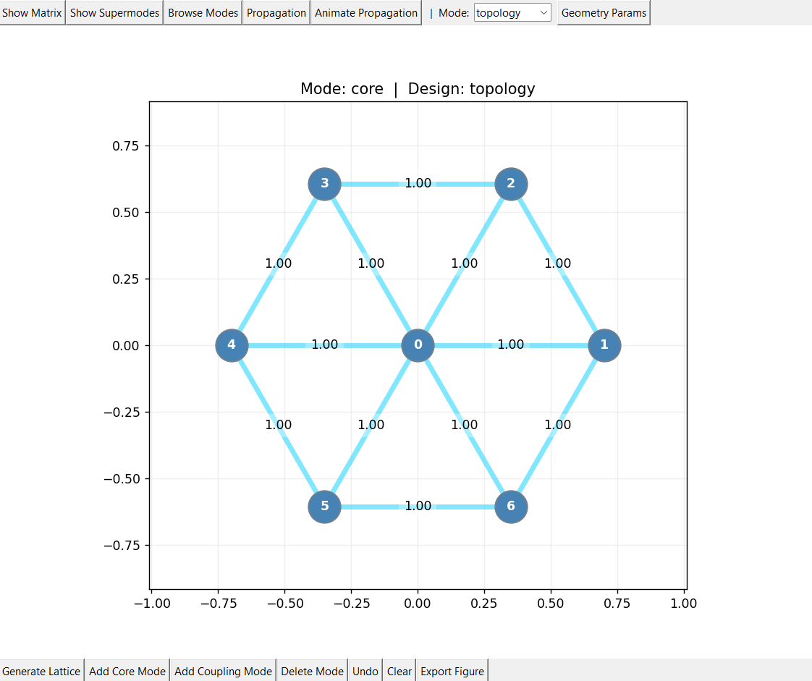
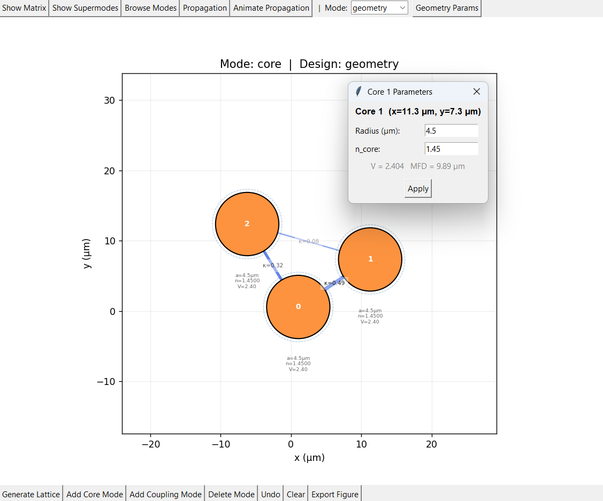
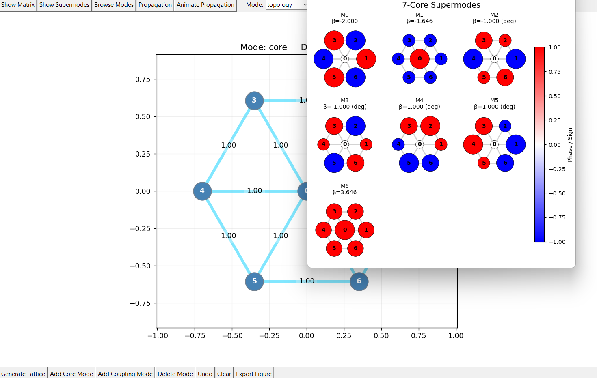
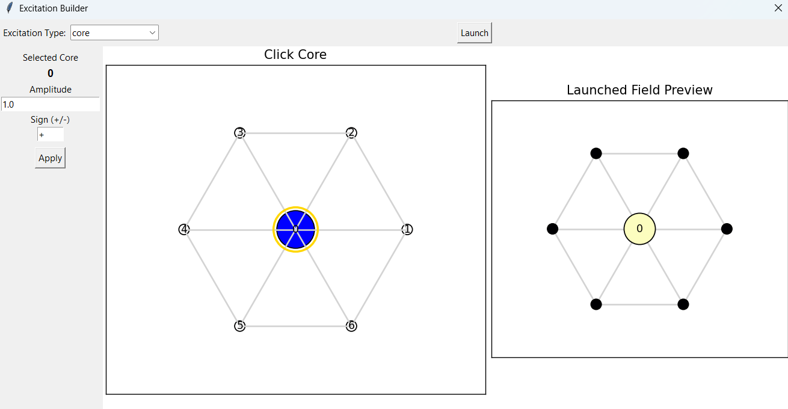

[](https://doi.org/10.5281/zenodo.20848303)

# MCF Graphical Builder

Interactive GUI for building and analyzing **multicore fibers**.

The app lets you design coupled-core structures either by manually defining topology and couplings or by placing physical cores and estimating couplings from geometry. It also includes tools to inspect the coupling matrix, supermodes, and propagation dynamics.

---

## Features

- Interactive core placement, dragging, and deletion
- Manual coupling editing (**topology mode**)
- Automatic coupling estimation from core geometry (**geometry mode**)
- Built-in lattice generators:
  - hex
  - square
  - ring
  - line
- Analysis tools:
  - coupling matrix viewer
  - supermode overview
  - propagation simulation & animation

---

## Screenshots

### Main window



### Geometry editor




### Supermode browser




### Propagation




---

## Installation

```bash
git clone https://github.com/Luke-N-G/mcf-graphical-builder.git
cd mcf-graphical-builder
python -m venv .venv
source .venv/bin/activate   # macOS / Linux
# .venv\Scripts\activate    # Windows

pip install -r requirements.txt
```

---

## Run

```bash
python app.py
```

---

## Quick Use

### Choose a design mode
- **Topology mode**: couplings are set manually
- **Geometry mode**: couplings are estimated automatically from core positions and parameters

### Build a structure
- **Add Core Mode** → place cores
- click and drag existing cores to reposition them
- **Add Coupling Mode** → connect cores and assign coupling coefficients
- **Delete Mode** → remove cores or couplings
- **Generate Lattice** → create line, ring, square, or hex structures

### Analyze
Use the top toolbar to open:
- **Show Matrix**
- **Show Supermodes**
- **Browse Modes**
- **Propagation**
- **Animate Propagation**

---

## Geometry Mode

In geometry mode, each core has physical parameters:
- position
- radius
- refractive index

Global geometry settings include:
- cladding refractive index
- wavelength
- default core radius
- default core refractive index

Double-click a core in geometry mode to edit its parameters.

---

## Model Notes

Geometry mode uses an approximate reduced-order coupling model based on mode-field / overlap estimates rather than a full electromagnetic solver. It is intended for interactive design and exploration, not as a replacement for a high-fidelity simulation workflow. At present, the propagation code assumes homogeneous cores and does not yet support inhomogeneous core parameters.

---

## Roadmap

Potential next additions:
- save / load project files
- refactor GUI and model logic into separate modules
- unit tests for coupling and lattice generation
- inhomogeneous core propagation
- nonlinear coupling
- example project files

---

## License

MIT Licence
